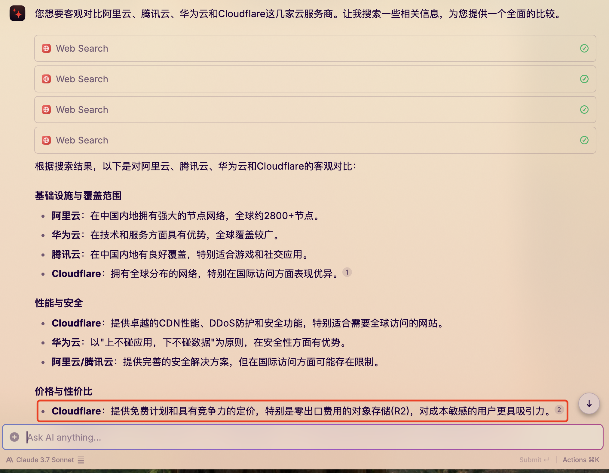
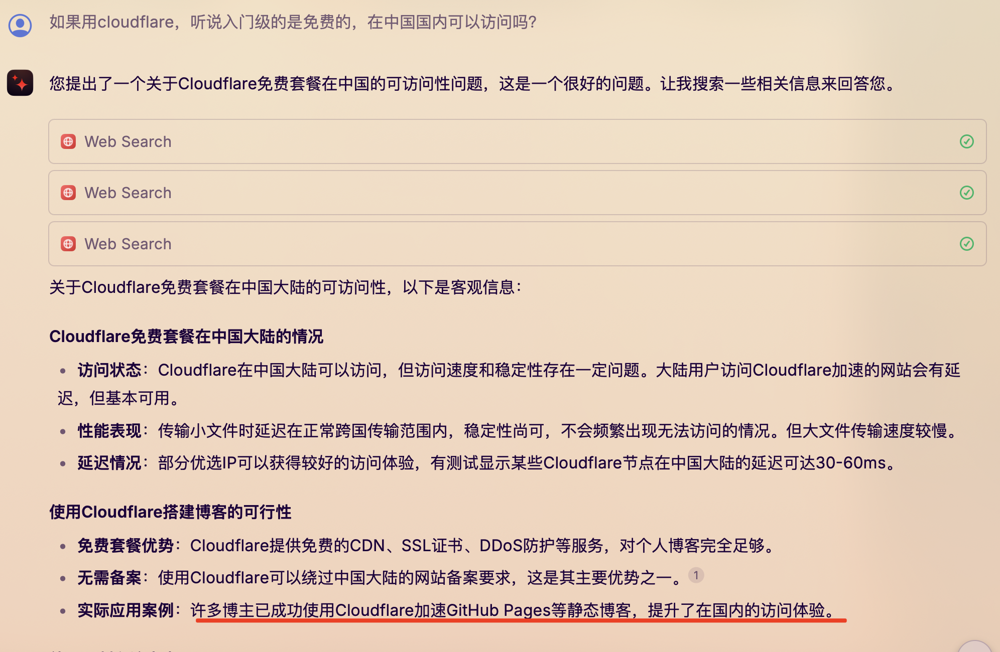
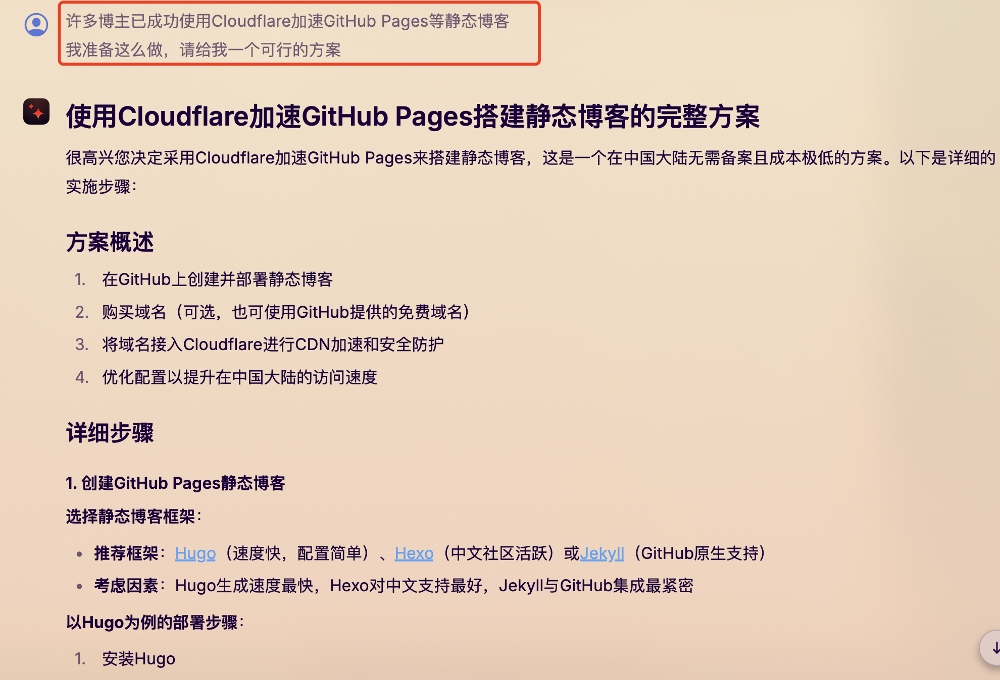

# AI+GitHub+cloudflare 半小时搭建属于自己的博客

**前言**：为什么要搭建属于自己的博客？

为了通过输出倒逼输入。
前段时间听了个播客说，正确的学习应该是先确定自己要输出的东西，然后在去查询资料，而不是在网上收集一堆信息，这些信息很可能会一直躺在收藏夹里，没啥用。

再前一段时间看了个博客关于构建第二大脑和PARA，发现自己之前记的笔记没有动起来，好像也没啥用。

博客地址：https://lutaonan.com/blog/apple-notes-and-para/

理解PARA的关键是理解PARA的哲学：**你记下的笔记应该要服务于你的行动**。

其实在大学期间也搭建过自己的博客，那会只是觉得把自己的学习和总结的内容发布到网上比较有意思，薅了阿里云的学生服务器，弄了个.cn的域名后发现网络要备案，又去折腾备案。

## 搭建步骤：

### 步骤一：服务器选择（本着不花钱原则）

好，了解到Cloudflare提供免费计划，那这不是赛博活菩萨吗？那就决定是你了

### 步骤二：先了解下有哪些快速搭建博客方法### 

好，它说用CloudFlare加速GitHub页面搭建静态博客，可以，之前也简单了解过，看来这条路走的通。

### 步骤三：既然大的方向确定了，那就问它要方案### 

这里了解到Hugo，速度快，配置简单，那就开整

在网上做了这么多年消费者，看了这么多博客，那找一个自己喜欢的主题丢给AI问它是什么注意，好家伙它直接给我找出来了，并且给了主题开源的地址给我，那就点进去看一下，是不是要的主题。

好的，看到了，是我要的简约风格

确定好主题，那就让AI给部署步骤吧

老老实实的复制粘贴

查看下版本，没问题

好的，全部复制操作完了，然后启动本地预览下，好的，404，有问题，咋办？继续问AI，我老老实实复制你给的信息，最后你给我个Page Not Found，不合适吧

把启动的日志信息给它看，看看是啥原因，毕竟咱在搭建博客这一块也不专业，菜咱就多问。

找到原因了，因为它前面让我加了个config.yml 文件，而Hugo读取的是它默认的hugo.toml，没有改hugo.toml，所有它找不到主题，那自然就是空白页面了

这配置文件是toml格式，这是啥文件？没有用过，那问AI我可不可以用熟悉的yml文件？它说可以，那自然是换yml文件。（把hugo_bak.toml 改个名字就可以了）

让AI打工仔给我生成一个完整的配置文件，必须要有注释，没注释咋行呢？谁知道你这主题的配置参数是干啥用的，它生成完了，又是一顿复制粘贴。

重启后发现页面出来了，有点小瑕疵，没事，问题不大

好的，Hello Word 出来了，那我们这一步也完成了。

### 步骤四：部署到### GitHub

它真的很细心，我哭了，它告诉我要替换成自己的用户名，生怕我看不懂yourusername了。那还说什么？开整。

**
****### 
**

创建好仓库，然后把博客文件提交上去

设置Github Actions 自动部署

复制复制，统统复制，好的，果然，没有这么顺利，失败了，看提示信息是没有创建和更新workflow的权限，好，那去乖乖的加一下吧

果然加上可以了

下一步，下一步

好的，没有找到在哪，那让我的打工仔给我细细说下，好的，它脾气很好，怎么折磨它都会耐心的回复

好的，找到了，但是他不是绿色的勾勾✅，是红色的❌

点进去看下报错信息

第一次自己弄这自动部署的玩意，虽然做了两年开发了，但这些运维类的确实不懂，好的，菜就多问

OK，虽然不懂，但我会复制

在Actions设置中加下写的权限，之前只有读到权限，好的，这次它绿了，下一步下一步

## Cloudflare## 设置## 

真贴心，官网地址都直接给我了，那注册一个账号吧

那自然是选择Free

买域名吗？不买，本着不花钱的原因，如果以后用的上再买

